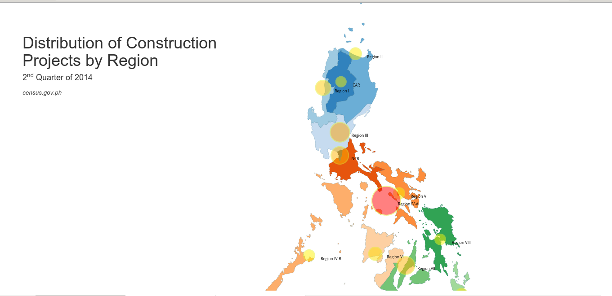

# FOSS4GPH 2014 

A mapping application which shows the number of infrastructure projects started at the end of 2nd Quarter of 2014.

Developed using [D3 js](http://d3js.org/) a javascript library for manipulating and visualizing data.

### Presentation
The main presentation can be found [here:](http://lkpanganiban.github.io/foss4g2014/#/) 

### Screenshots:
 * Main Application

### Developed by:

 * [Charmyne Mamador](https://github.com/chamthesleeptalker)
 * [Luis Caezar Ian Panganiban](https://github.com/lkpanganiban)
